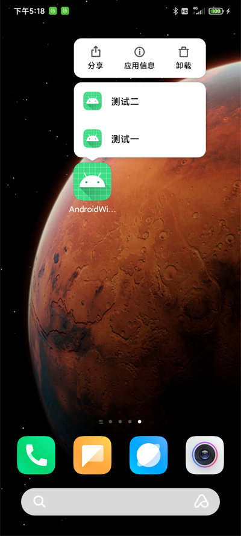

# AndroidWidget

AndroidWidget可以实现在Android端，长按展示快捷方式及桌面小组件的创建，具体使用大家可以参照源码。

## Demo效果预览

<br/>

## 欢迎关注作者

微信搜索【Android干货铺】，或扫描下面二维码关注，查阅更多技术文章！

<br/>

## License

```
Copyright (C) AbnerMing, AndroidWidget Open Source Project

Licensed under the Apache License, Version 2.0 (the "License");
you may not use this file except in compliance with the License.
You may obtain a copy of the License at

     http://www.apache.org/licenses/LICENSE-2.0

Unless required by applicable law or agreed to in writing, software
distributed under the License is distributed on an "AS IS" BASIS,
WITHOUT WARRANTIES OR CONDITIONS OF ANY KIND, either express or implied.
See the License for the specific language governing permissions and
limitations under the License.
```

